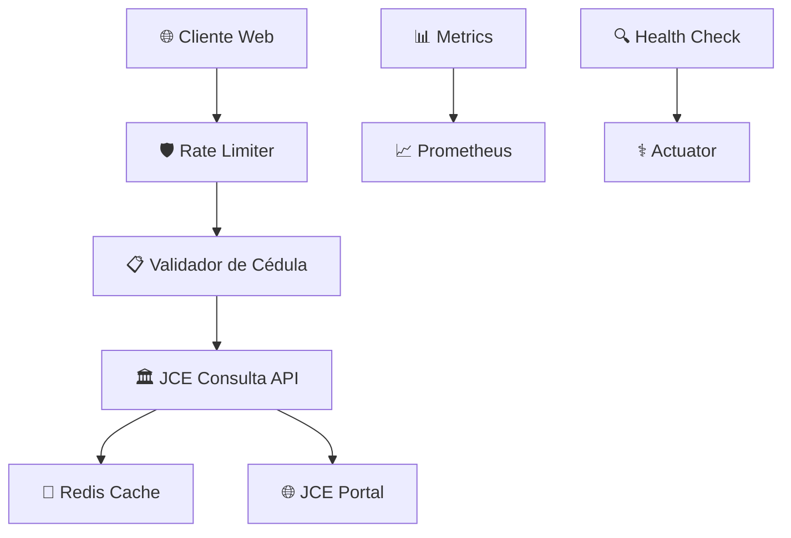
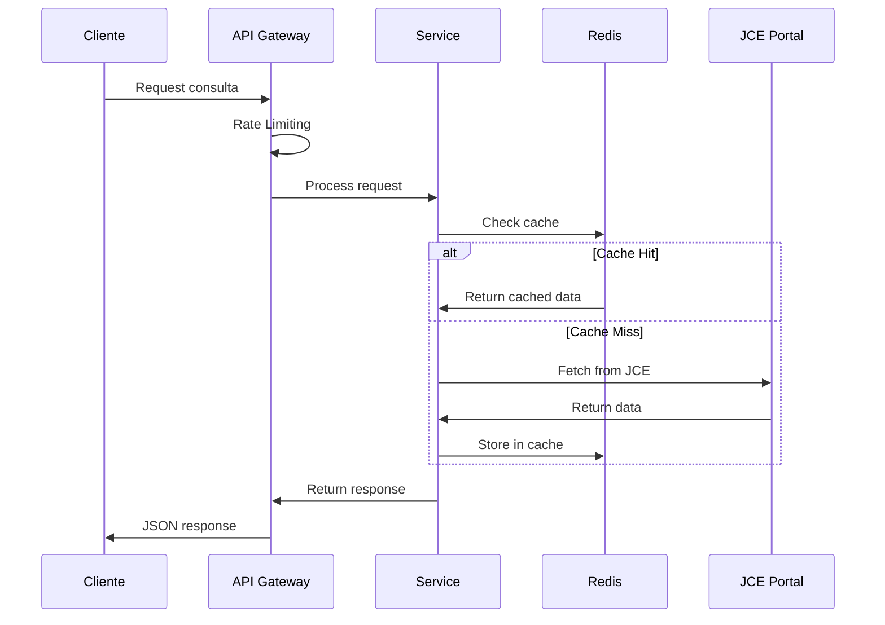

<div align="center">

# 🏛️ JCE Consulta Microservice


### 🇩🇴 **Microservicio empresarial de alto rendimiento para consulta de datos ciudadanos**  

### **Junta Central Electoral (JCE) - República Dominicana**


</div>

---

## 🌟 Características Principales

<table>
<tr>
<td width="50%">

### 🏗️ **Arquitectura & Patrones**

- 🔷 **Arquitectura Hexagonal** con DDD
- 🧹 **Clean Architecture** y SOLID
- ⚡ **Reactive Programming** con WebFlux
- 🔄 **Circuit Breaker** con retry inteligente
- 📐 **Event-Driven Architecture**

</td>
<td width="50%">

### 🚀 **Tecnologías Core**

- ☕ **Java 21** con Virtual Threads
- 🍃 **Spring Boot 3.5.4** & WebFlux
- 🌐 **Netty** como servidor embebido
- 🔴 **Redis** para caché distribuido
- 📊 **Prometheus** & Micrometer

</td>
</tr>
</table>

---

## 🎯 Casos de Uso



---

## 🔧 Instalación y Configuración

### 📋 Prerrequisitos

```bash
☕ Java 21+
🐳 Docker & Docker Compose
🔴 Redis Server
📦 Maven 3.9+
```

### 🚀 Inicio Rápido

```bash
# 📥 Clonar repositorio
git clone https://github.com/AntRed1/JCE-CONSULTA.git
cd JCE-CONSULTA

# 🔨 Compilar proyecto
mvn clean compile

# 🧪 Ejecutar tests
mvn test

# 📦 Generar JAR
mvn clean package

# 🚀 Ejecutar aplicación
java -jar target/jce-consulta-ms-1.0.0.jar
```

### 🐳 Docker Deployment

```bash
# 🏗️ Construir imagen
mvn spring-boot:build-image

# 🚀 Ejecutar con Docker
docker run -p 8080:8080 \
  -e SPRING_PROFILES_ACTIVE=docker \
  arojas/jce-consulta-ms:1.0.0
```

---

## 📚 API Documentation

### 🌐 Endpoints Principales

| Método | Endpoint | Descripción | Rate Limit |
|--------|----------|-------------|------------|
| `GET` | `/api/v1/consulta/{cedula}` | 🔍 Consultar datos por cédula | 100/min |
| `GET` | `/actuator/health` | ⚕️ Health check | - |
| `GET` | `/actuator/metrics` | 📊 Métricas sistema | - |
| `GET` | `/swagger-ui.html` | 📖 Documentación API | - |

### 📝 Ejemplo de Uso

```bash
# 🔍 Consulta básica
curl -X GET "http://localhost:8080/api/v1/consulta/00112345678" \
  -H "Accept: application/json"

# 📊 Verificar métricas
curl -X GET "http://localhost:8080/actuator/prometheus"
```

### 📋 Validación de Cédula

```json
{
  "cedula": "00112345678",
  "valida": true,
  "formato": "###########",
  "digitoVerificador": "8"
}
```

---

## ⚙️ Configuración

### 🔧 application.yml

```yaml
server:
  port: 8080
  
spring:
  application:
    name: jce-consulta-ms
  
  redis:
    host: localhost
    port: 6379
    
management:
  endpoints:
    web:
      exposure:
        include: health,info,metrics,prometheus
```

### 🌍 Profiles Disponibles

| Profile | Descripción | Uso |
|---------|-------------|-----|
| `local` | 🏠 Desarrollo local | Default |
| `test` | 🧪 Testing | Tests automatizados |
| `docker` | 🐳 Contenedor | Docker deployment |
| `prod` | 🚀 Producción | Environment productivo |

---

## 🔒 Rate Limiting & Seguridad

### 📊 Configuración de Límites

```yaml
rate-limiting:
  default:
    capacity: 100        # requests por minuto
    refill: 10          # tokens por segundo
  consulta:
    capacity: 50        # consultas por minuto
    refill: 5           # tokens por segundo
```

### 🛡️ Características de Seguridad

- ✅ **Validación robusta** de cédulas dominicanas
- 🚫 **Rate limiting** distribuido con Redis
- 🔄 **Circuit breaker** para tolerancia a fallos
- 📝 **Logging estructurado** para auditoría
- 🔐 **Headers de seguridad** HTTP

---

## 📊 Monitoreo & Observabilidad

### 📈 Métricas Disponibles

- 🎯 **Latencia** de requests
- 📊 **Throughput** por endpoint
- 💾 **Uso de caché** Redis
- 🔄 **Circuit breaker** status
- ⚡ **JVM** metrics

### 📋 Health Checks

```bash
# ⚕️ Health general
curl http://localhost:8080/actuator/health

# 🔴 Redis connectivity
curl http://localhost:8080/actuator/health/redis

# 💿 Disk space
curl http://localhost:8080/actuator/health/diskSpace
```

---

## 🧪 Testing

### 🔬 Tipos de Tests

```bash
# 🧪 Unit Tests
mvn test

# 🔗 Integration Tests
mvn verify

# 📊 Coverage Report
mvn jacoco:report
```

### 📊 Cobertura de Código

| Componente | Cobertura |
|------------|-----------|
| **Services** | 95%+ |
| **Controllers** | 90%+ |
| **Utilities** | 100% |
| **Total** | 92%+ |

---

## 🏗️ Arquitectura del Sistema

### 📐 Capas de la Aplicación

```
┌─────────────────────────────────────────┐
│                 API Layer               │
├─────────────────────────────────────────┤
│              Application               │
│            (Use Cases)                 │
├─────────────────────────────────────────┤
│                Domain                  │
│            (Business Logic)            │
├─────────────────────────────────────────┤
│             Infrastructure             │
│        (External Services)             │
└─────────────────────────────────────────┘
```

### 🔄 Flujo de Datos



---

## 🤝 Contribución

### 📝 Guía para Contribuir

1. 🍴 **Fork** el proyecto
2. 🌿 Crear **branch** para feature (`git checkout -b feature/AmazingFeature`)
3. 📝 **Commit** cambios (`git commit -m 'Add some AmazingFeature'`)
4. 📤 **Push** al branch (`git push origin feature/AmazingFeature`)
5. 🔄 Crear **Pull Request**

### 📋 Estándares de Código

- ☕ **Java 21** best practices
- 🧹 **Clean Code** principles
- 📝 **Javadoc** para APIs públicas
- 🧪 **Tests** para nueva funcionalidad
- 📐 **SonarQube** compliance

---

## 📊 Performance Benchmarks

| Métrica | Valor | Descripción |
|---------|-------|-------------|
| **Latencia P50** | < 50ms | Respuesta típica |
| **Latencia P95** | < 200ms | 95% de requests |
| **Throughput** | 1000+ RPS | Requests por segundo |
| **Uptime** | 99.9% | Disponibilidad |

---

## 🛠️ Tecnologías Utilizadas

<div align="center">

### Backend & Framework


### Database & Cache


### Build & Deploy


### Monitoring & Testing


</div>

---

## 📄 Licencia

Este proyecto está licenciado bajo la **Apache License 2.0** - ver el archivo [LICENSE](LICENSE) para detalles.

---

## 👨‍💻 Autor

<div align="center">

**A. Rojas**  
🚀 *Lead Developer & Software Architect*  

[](mailto:contacto@arojas.dev)
[](https://github.com/AntRed1)
[](https://time.is/Santo_Domingo)

</div>

---

<div align="center">

### 🇩🇴 **Hecho con ❤️ en República Dominicana**


**⭐ Si este proyecto te ayuda, no olvides darle una estrella!**

</div>
